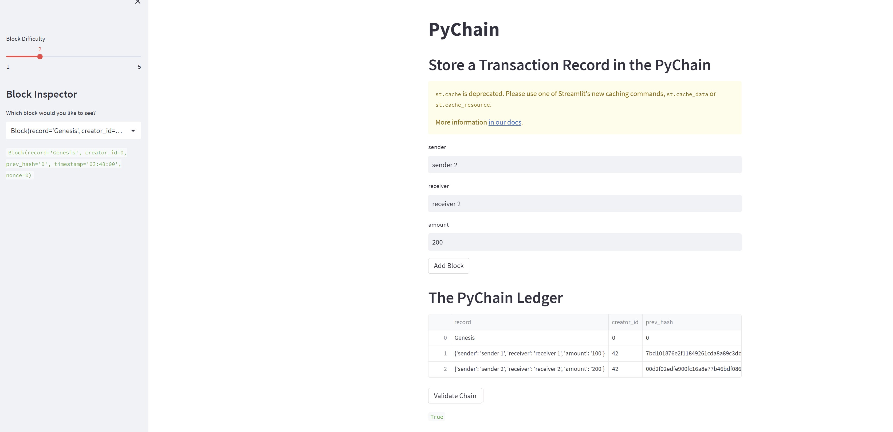
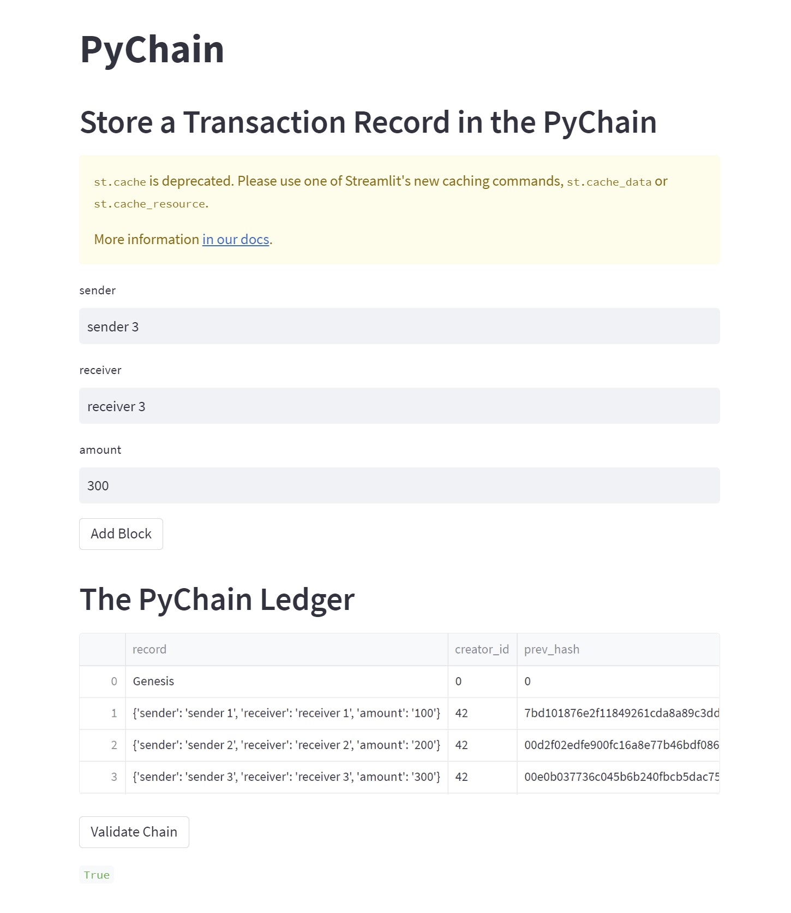

# pychain.py

## Store a Transaction Record in the Pychain

### Steps
1. Define a new class Record (sender, receiver, and amount)
2. Modify existing block data with new class record
3. Add input data for Streamlit Interface
4. Test Pychain ledger on Streamlit Interface

### Results

- Successfully stored transaction record in the pychain and validated the record by using Streamlit Interface. 